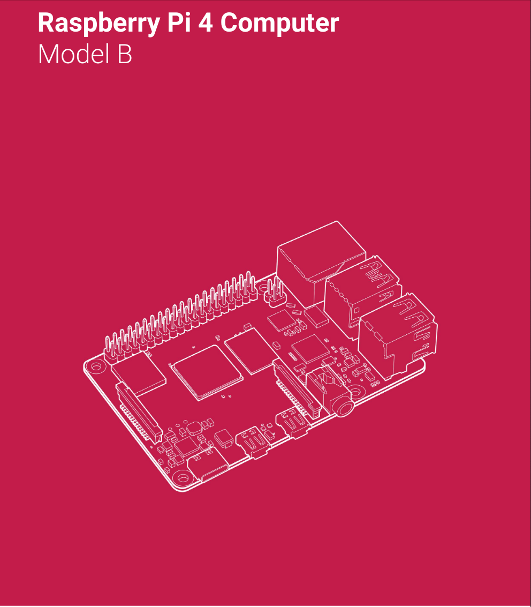
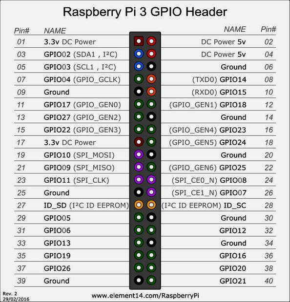

Note: a new version 4 has come out and we recommend to use
that.

The raspberry PI 4 is a very good development platform. It is
available with 2GB, 4GB and 8GB main memory. If you decide to buy it
we recommend to get the 8GB version. If money is thight get the
4GB. Due to its small memory we suggest not to buy teh 2GB
version. This you shoudl only get if your have a very small
development and ready product that does not require more memory. As
you likely will use the PI also as develoopment platform, the 8GB
version seems approriate.

The cost is

* \$35 2GB
* \$55 4GB
* \$90 8GB

You will need some additional components to make sure you can use it.
THis includes a power adapter, an SD Card writer, and a special HDMI
cable.  As PIs are popular and often sold out, you may want to
consider a complete kit.  Although these kits are slightly more
expensive as if you were to buy them seperately you may not have a
choice. The kit from Cana costs about $120 without keyboard and mouse:

[Cana Kit ](https://www.canakit.com/raspberry-pi-4-complete-starter-kit.html) 

Please be reminded to never
connect or power the raspberry with your computers USB port. It draws
some significant amperage and we do not want you to destroy your
computer. We recommend that you buy a certified power adapter. The price for a board
is so cheap that you could even create your own mini cluster as a
project. We do not recommend any older versions of Raspberry as they are
less powerful and do not contain built-in Bluetooth or WiFi.

## Specification Raspberry PI 4B

The Raspberry PI 4B is shown in @fig:pi4
{#fig:pi4}

The board has the following properties:

* Broadcom BCM2711, Quad core Cortex-A72 (ARM v8) 64-bit SoC @ 1.5GHz
* 2GB, 4GB or 8GB LPDDR4-3200 SDRAM (depending on model)
* 2.4 GHz and 5.0 GHz IEEE 802.11ac wireless, Bluetooth 5.0, BLE
* Gigabit Ethernet
* 2 USB 3.0 ports; 2 USB 2.0 ports.
* Raspberry Pi standard 40 pin GPIO header (fully backwards compatible with previous boards)
* 2 × micro-HDMI ports (up to 4kp60 supported)
* 2-lane MIPI DSI display port
* 2-lane MIPI CSI camera port
* 4-pole stereo audio and composite video port
* H.265 (4kp60 decode), H264 (1080p60 decode, 1080p30 encode)
* OpenGL ES 3.0 graphics
* Micro-SD card slot for loading operating system and data storage
* 5V DC via USB-C connector (minimum 3A*)
* 5V DC via GPIO header (minimum 3A*)
* Power over Ethernet (PoE) enabled (requires separate PoE HAT)
* Operating temperature: 0 – 50 degrees C ambient

* A good quality 2.5A power supply can be used if downstream USB peripherals consume less than 500mA in total.

[ Product Brief](https://static.raspberrypi.org/files/product-briefs/200521+Raspberry+Pi+4+Product+Brief.pdf)

## Pin Layout

The PI 4, 3B, 3B+ and Zero come with a number of pins that can be used to
attach sensors. It is convenient to have the pinout available for your
project. Hence we provide a pinout layout in @fig:pi-layout. Other
Pis will have a differnt pinout and you will have to locate them on
the internet.

{#fig:pi-layout}

## References

1. <https://www.raspberrypi.org/documentation/hardware/raspberrypi/README.md>

