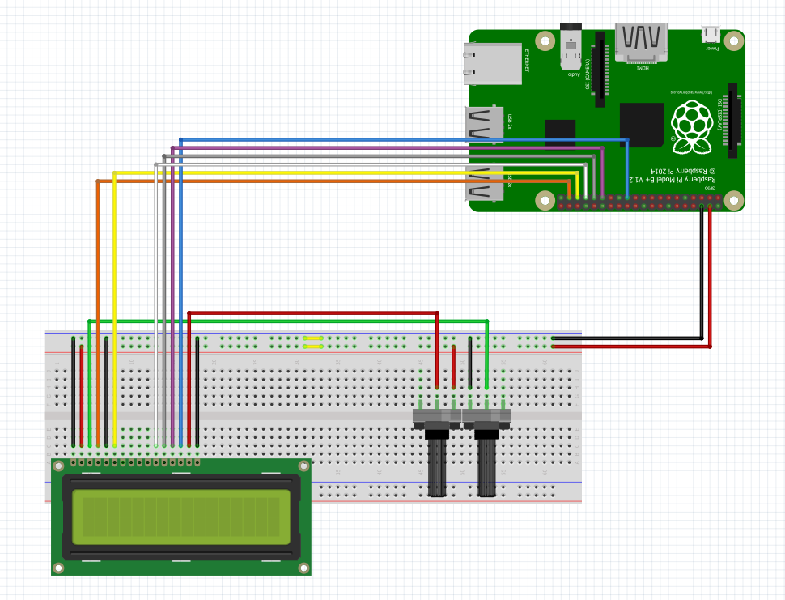

The 16x2 LCD screen can be used as a display for the Raspberry Pi.  To
set up the LCD screen connect the wires as shown in @fig:LCD_setup.
You will also need two potentiometers in order to adjust the contrast
and the brightness.

{#fig:lcd_setup}

Once everything is correctly wired up the LCD class can be used to
print text to the LCD display.

```python
from RPLCD import CharLCD
from RPi import GPIO

class LCD_Display(object):
	"""docstring for LCD_Display
	This class is for the 16 x 2 LCD component
	"""
	def __init__(self, cols=16, rows=2, rs=37, e=35, data_pins = [33,31,29,23], mode='BOARD'):
		GPIO.setwarnings(False)
		if mode == 'BCM':
			self.lcd = CharLCD(cols=cols, rows=rows, pin_rs=rs, pin_e=e, pins_data=data_pins, numbering_mode=GPIO.BCM)
		else:
			self.lcd = CharLCD(cols=cols, rows=rows, pin_rs=rs, pin_e=e, pins_data=data_pins, numbering_mode=GPIO.BOARD)
		

	def display_string(self, string, clear='N', pos=(0,0)):
		if clear == 'Y':
			self.lcd.clear()
		else:
			pass
		self.lcd.cursor_pos = pos
		self.lcd.write_string(string)

if __name__ == '__main__':
	LCD_Display().display_string(u'Hello World!')
```

## Refernces

1. [LCD Class](https://github.com/cloudmesh-community/fa18-523-84/blob/master/paper/code/LCD.py)
