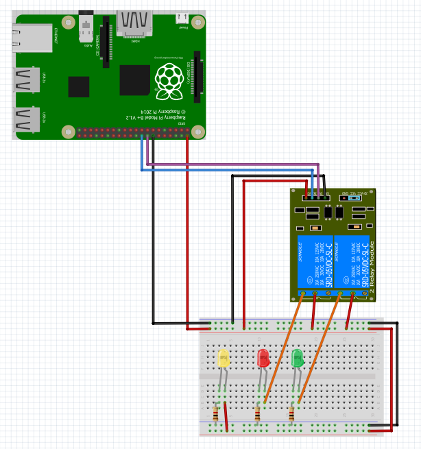

The relay module can be used as a switch to complete a circuit.  The module can be purchased as an individual component or may be included on a board with 2, 4 or more relay switches.  In this example we will be using a two channel relay module. To set up the relay module connect the wires to the Raspberry Pi as shown in @fig:relay_setup.

{#fig:relay_setup}

Once the module is set up you can use the relay_switch class to turn the relays on and off.

```python
# Code modified from source: https://tutorials-raspberrypi.com/raspberry-pi-control-relay-switch-via-gpio/
# Actual pins in example: 16 & 18

import RPi.GPIO as GPIO
import time

class relay_switch(object):
	"""docstring for relay_switch
	currently set up for a 2 channel relay
	"""
	def __init__(self, pin=8, pin_setup='BOARD'):
		self.pin = pin
		if pin_setup == 'BCM':
			GPIO.setmode(GPIO.BCM)
		else:
			GPIO.setmode(GPIO.BOARD)
		GPIO.setwarnings(False)
		GPIO.setup(self.pin, GPIO.OUT)
		
	def on(self):
		GPIO.output(self.pin, GPIO.LOW)

	def off(self):
		GPIO.output(self.pin, GPIO.HIGH)
		

# Create loop to flash LEDs

if __name__ == '__main__':
	try:
		r1 = relay_switch(pin=16)
		r2 = relay_switch(pin=18)
		counter = 15
		while counter > 0:
			r1.on()
			time.sleep(0.5)
			r2.on()
			time.sleep(0.5)
			r1.off()
			time.sleep(0.5)
			r2.off()
			time.sleep(0.5)
			counter -= 1
	except KeyboardInterrupt:
		print('\n\n *** Stopping Program ***')
		try:
			sys.exit(0)
		except SystemExit:
			os._exit(0)
```
			
## Refernces

[Relay  Class](https://github.com/cloudmesh-community/fa18-523-84/blob/master/paper/code/relay_switch.py)
