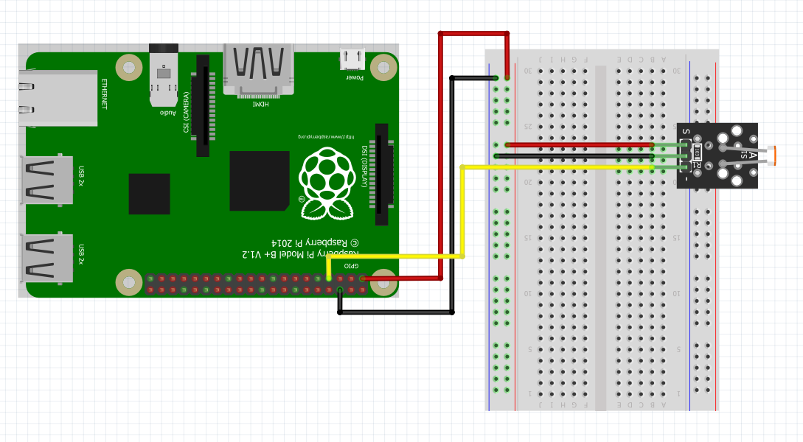

The light sensor used in this example can be purchased [individually](https://www.amazon.com/Gowoops-Digital-Intensity-Detection-Photosensitive/dp/B01N1FKS4L/ref=sr_1_3?ie=UTF8&qid=1543528066&sr=8-3&keywords=arduino+light+sensor+module) or as part of a sensor kit.  To set up the light sensor module connect the wires to the Raspberry Pi as shown in @fig:light_setup.  The sensor shown in this example has three pins.  However, some sensor modules may have four pins.  In most cases the extra pin is not necessary.

{#fig:light_setup}

Once you have set up the light sensor you can use the light_sensor class to retrieve data from the light sensors.  The light sensor will return "1" if light is not detected and a "0" if the sensor detects light.  Some sensor modules also include a potentiometer which can be adjusted to change the sensitivity of the light sensor.

```python

import RPi.GPIO as GPIO
import time
import sys
import os

class LightSensor(object):
	"""Pin numbers for LightSensor are based on BOARD numbers by default.
	The number 1 will be returned if the light sensor is off and 0 if the
	sensor is activated.
	"""
	def __init__(self, pin=7, pin_setup='BOARD'):
		self.pin = pin
		if pin_setup == 'BCM':
			GPIO.setmode(GPIO.BCM)
		else:
			GPIO.setmode(GPIO.BOARD)
		GPIO.setwarnings(False)
		GPIO.setup(self.pin,GPIO.IN)
			
	def get(self):
		return GPIO.input(self.pin)


if __name__ == '__main__':
	try:
		light = LightSensor(pin=11)
		while True:
			print(light.get())
			time.sleep(1)
	except KeyboardInterrupt:
		print('\n\n *** Stopping Program ***')
		try:
			sys.exit(0)
		except SystemExit:
			os._exit(0)
```

## References

1. [Sensor on Amazon](https://www.amazon.com/Gowoops-Digital-Intensity-Detection-Photosensitive/dp/B01N1FKS4L/ref=sr_1_3?ie=UTF8&qid=1543528066&sr=8-3&keywords=arduino+light+sensor+module)
2. [Source: Light Sensor Class](https://github.com/cloudmesh-community/fa18-523-84/blob/master/paper/code/light_sensor.py)
3. [UGEAR light sensor](https://www.uugear.com/portfolio/using-light-sensor-module-with-raspberry-pi/)

