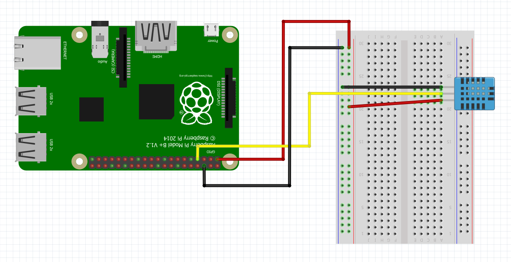

The temperature and humidity sensor used in this example is the DHT11 sensor which can be purchased as a part of the [Kookye Smart Home Sensor kit](https://www.amazon.com/gp/product/B01J9GD3DG/ref=oh_aui_detailpage_o03_s01?ie=UTF8&psc=1) or the [Elegoo Uno Kit.](https://www.amazon.com/ELEGOO-Project-Starter-Tutorial-Arduino/dp/B01D8KOZF4/ref=sr_1_6?s=electronics&ie=UTF8&qid=1542065611&sr=1-6&keywords=dht11+temperature+and+humidity+module).  The humidity component of the DHT11 works by measuring the conductivity between two electrodes. Between these electrodes there is a substrate that holds moisture and as the moisture changes the conductivity changes [@How_DHT11_Works]. The temperature sensor of the DHT11 works in the same way as the DS18B20.

To set up the DHT11 sensor connect jumper wires to the Raspberry Pi as shown in @fig:dht11_setup.  Ensure that the ground wire of the DHT11 is connected to the ground rail of the breadboard or a ground pin on the Raspberry Pi.  The VCC wire of the DHT11 should be connected to 3.3v from the Raspberry Pi.  To receive data the middle pin should be connected to one of the GPIO pins on the Raspberry Pi.  In this example and associated code we connect the data wire to GPIO 4 on the Raspberry Pi as shown in @fig:dht11_setup.

{#fig:dht11_setup}

Once you have checked that the DHT11 is set up correctly you will need to set up the Adafruit_DHT module for python.  The sample python class utilizes the Adafruit_DHT module which can be set up by executing the following code in a terminal on your Raspberry Pi [@Adafruit_setup].

```bash
git clone https://github.com/adafruit/Adafruit_Python_DHT.git
cd Adafruit_Python_DHT
sudo apt-get update
sudo apt-get install build-essential python-dev
sudo python setup.py install
```

Once you have set up the Adafruit_DHT module you can use the python class to display the temperature and humidity reading to the terminal.


An example of a class used for DHT11 temp and humididy sensor is shown
next


```python
import sys
import os
import time
import Adafruit_DHT

class DHT11(object):

	def __init__(self, pin=4):  # pin uses GPIO numbers and defaults to GPIO 4 
		self.pin = pin
		self.sensor = Adafruit_DHT.DHT11

	def get(self, temp_measure='celcius'):
		humid, temp = Adafruit_DHT.read_retry(self.sensor, self.pin)
		if humid is not None and temp is not None and temp_measure == 'celcius':
			return humid, temp
		elif humid is not None and temp is not None and temp_measure == 'farenhiet':
			temp = temp * 9.0 / 5.0 + 32.0
			return humid, temp
		else:
			print('Error: no reading detected')
			return


# loop to read temp and humidity

if __name__ == '__main__':
	try:
		dht11 = DHT11(pin=22)
		while True:
			humid, temp = dht11.get(temp_measure='farenhiet')
			print('Temp: '+str(temp)+u'\u00b0'+'F  Humidity: '+str(humid)+'%') # \u00b0 = the degrees symbol
			time.sleep(1)
	except KeyboardInterrupt:
		print('\n\n *** Stopping Program ***')
		try:
			sys.exit(0)
		except SystemExit:
			os._exit(0)
```

## Refernces

1. [First version of class](https://github.com/cloudmesh-community/fa18-523-84/blob/master/paper/code/temp_humid.py)
2. [Samrt cloud Thermostat](https://github.com/cloudmesh-community/fa18-523-84/blob/master/project-code/)
3. [How to set up the dht11](http://www.circuitbasics.com/how-to-set-up-the-dht11-humidity-sensor-on-the-raspberry-pi/)
4. [DHT at Adafruit](https://github.com/adafruit/Adafruit_Python_DHT).
