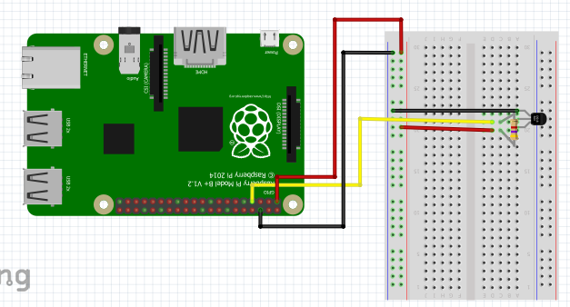

The DS18B20 is a thermoresistive temperature sensor and can be found
in many of the sensor kits referenced in this book.  To set up the
DS18B20 connect the jumper wires as shown in @fig:ds18b20_setup.  If
you have an individual sensor instead of a sensor module you will need
to use a 4.7k ohm resistor as shown in the diagram.  The resistor
allows the one wire interface to work properly and should be used to
avoid damage to the sensor [@DS18B20_resistor].  If you have a DS18B20
module it may already include a resistor and you will not need to add
another.  Be sure to check before setting up your sensor.

{#fig:ds18b20_setup}

Once you have set up the wiring of the DS18B20 you will need to set up
the one wire interface.  This can be done with the following steps
[@DS18B20_code_setup].

1. In a terminal enter:  ``` sudo nano /boot/config.txt ```
2. Scroll to the bottom of this text file and enter ``` dtoverlay=w1–gpio ```

Once the setup is complete you can use the DS18B20 code provided to
output the temperature to the terminal. An example code is included
next

```python
import os
import sys
import glob
import time

class ds18b20(object):
	"""docstring for ds18b20
	DS18B20 sensor should be plugged into GPIO4
	Returns temp in celcius then farenhiet
	"""
	def __init__(self):
		os.system('modprobe w1-gpio')
		os.system('modprobe w1-therm')
		self.base_dir = '/sys/bus/w1/devices/'
		self.device_folder = glob.glob(self.base_dir + '28*')[0]
		self.device_file = self.device_folder + '/w1_slave'

	def read_temp_raw(self):
		f = open(self.device_file, 'r')
		lines = f.readlines()
		f.close()
		return lines

	def get(self):
		lines = self.read_temp_raw()
		while lines[0].strip()[-3:] != 'YES':
			time.sleep(0.2)
			lines = read_temp_raw()
		equals_pos = lines[1].find('t=')
		if equals_pos != -1:
			temp_string = lines[1][equals_pos+2:]
			temp_c = float(temp_string) / 1000.0
			temp_f = temp_c * 9.0 / 5.0 + 32.0
			return temp_c, temp_f
		

if __name__ == '__main__':
	try:
		temperature = ds18b20()
		while True:
			print(temperature.get())
			time.sleep(1)
	except KeyboardInterrupt:
		print('\n\n*** Stopping Program ***')
		try:
			sys.exit(0)
		except SystemExit:
			os._exit(0)
```

Refernces:

1. [DS18b20 Tutorial] (http://www.circuitbasics.com/raspberry-pi-ds18b20-temperature-sensor-tutorial/)
