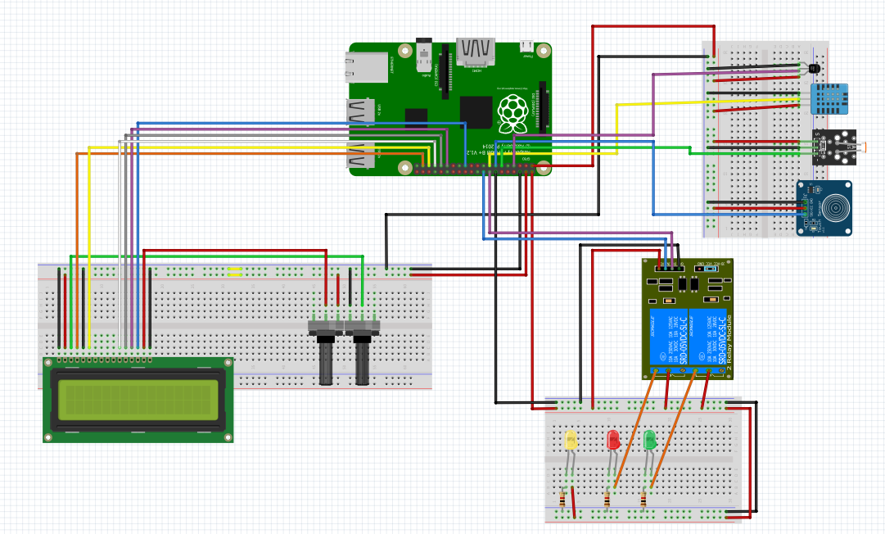
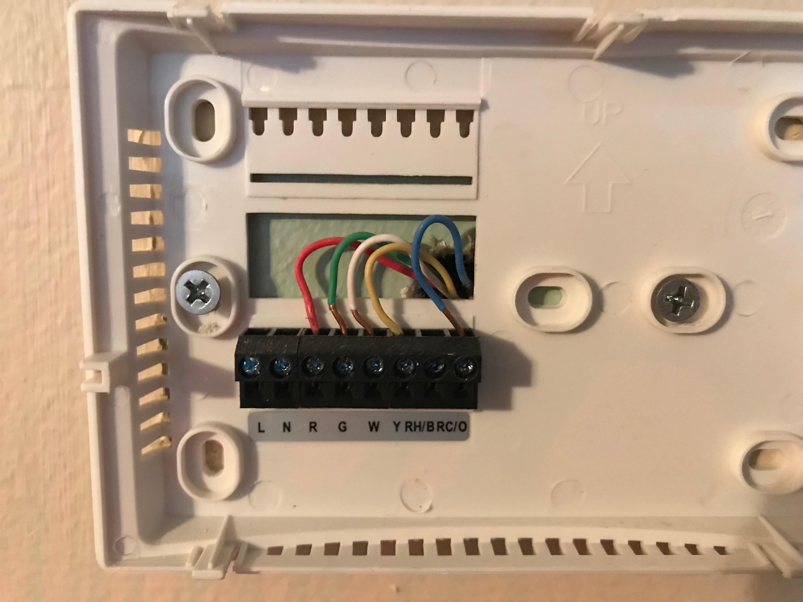
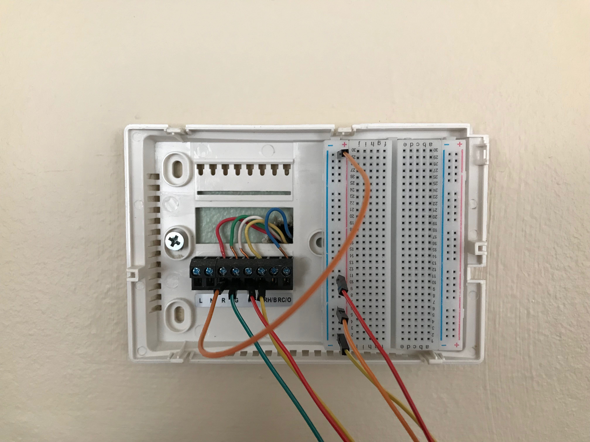
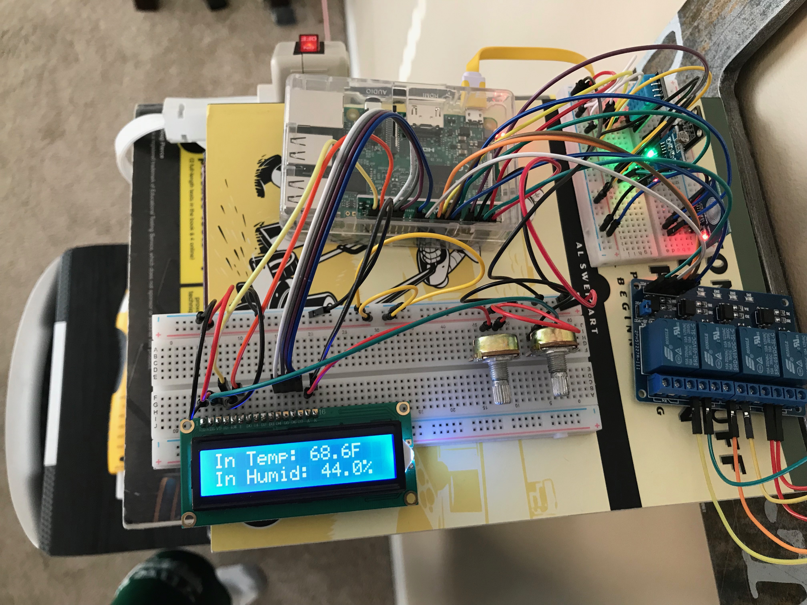

  
In this example we will combine some of the sensors discussed in this section to create a smart thermostat.  The first step of this project is to make sure that you have a Raspberry Pi which has Raspbian installed and is configured appropriately.  Instructions for how to complete the basic set up of your Raspberry Pi can be found in the [Setting up a Single Raspberry PI](https://github.com/ahilgenkamp/book/blob/master/chapters/pi/setup-ultimate.md) section of this book.

Prerequisites:

 * Raspberry Pi 3 with Raspbian installed
 * DHT11 Temperature and Humidity Sensor
 * Photosensitive Light Sensor
 * Capacitive Touch Sensor
 * 2 Channel Relay Module
 * 16x2 LCD display
 * Three bread boards
 * Two potentiometers
 * 4 female to female jumper wires
 * 24 male to male jumper wires
 * 12 male to female jumper wires

If using the LED's you will want the additional components listed next:

  * Three 4.7k ohm resistors
  * Three LED's
  * 3 additional male to male jumper wires
  * 4 additional male to female jumper wires

Once you have the necessary components you will need to connect the wires as shown in @fig:smart_therm.  The LED lights in this example represent the connections to the actual thermostat. It is suggested that you test the set up using the LED's to ensure that everything is wired correctly and that you are getting the expected results.  We will cover how to connect the smart thermostat to your HVAC system later in this example. For this project three separate breadboards are used to hold different components.  The first one will hold the LCD and potentiometers used to adjust contrast and brightness.  The second will hold all of the sensors and the third will be used to either hold the LED's or distribute power from the HVAC system.

{#fig:smart_therm}

Once all of the components are connected as shown in @fig:smart_therm we need to test each of the sensors.  To do this we will first need to set up the raspberry pi.  This can be done by running the thermostat_setup.sh shell script.  To run this open a terminal and type ```nano thermostat_setup.sh``` then copy the code from [thermostat_setup.sh](https://github.com/cloudmesh-community/fa18-523-84/blob/master/paper/code/thermostat_setup.sh).  Once you have copied the code, close the editor and run ```chmod u+x thermostat_setup.sh```.  Then run ```./thermostat_setup.sh``` to run the code to add the code and dependencies needed for this project.

Once the thermostat_setup.sh script has finished running there will be a new directory containing the code for this project.  Navigate to this directory with ```cd ~/git-repos/fa18-523-84/paper/code```.  We will now test each of the components by running the following commands.

  * ```python3 LCD.py``` This should show the output "Hello World!" on the LCD screen.
  * ```python3 temp_humid.py``` Should show the current temp and humidity.
  * ```python3 ds18b20.py``` Should show temp. (using this sensor as well because temp is more accurate)
  * ```python3 light_sensor.py``` Should show either 1 or 0 depending on if light is detected.
  * ```python3 relay_switch.py``` Connected to the LED's this should turn the LED's on and off.
  * ```python3 touch_sensor.py``` When the sensor is touched "Hey!" should be printed to the terminal.

Once you have tested the components and have ensured that they work you can run ```python3 smart_therm_not_connected.py``` to start the smart thermostat.  The code should print the current system status to the terminal.

[Smart Thermostat Code](https://github.com/cloudmesh-community/fa18-523-84/blob/master/paper/code/smart_therm_not_connected.py)

Now that we have tested each of the components and have tested the smart thermostat code using the LED's we can connect to the HVAC system. Each HVAC system is different so be sure to do some research on how your specific system works.  Generally there will be a power wire that you can connect to the relay switch and then connect the other wires to the appropriate terminals [@Smart_therm_example].  Based on the readings from the other sensors the code will determine which relay to turn on, which will complete the circuit sending a signal to the HVAC system.  The system used in this example is shown in @fig:wiring_start.  For this system the red wire is 24v power, green connects to the fan, white connects to the heat, yellow connects to the AC compressor and blue is ground [@Smart_therm_example].

{#fig:wiring_start}

To connect the Raspberry Pi smart thermostat to the system we need a way to supply power to each of the signal wires.  To do this we can use a breadboard to supply power to each of the three relay switches as shown in @fig:wiring_final.  When the relay switch is activated the signal will be supplied to the appropriate wire.

{#fig:wiring_final}

Once the system is wired correctly we can test the code again now that it is wired to the HVAC system.  Running ```python3 smart_therm_not_connected.py``` will start the program but to run the program in the background use ```nohup python3 smart_therm_not_connected.py &```.  When running the program in the background the output will be saved to the nohup.out file.  Now you can adjust settings in the program to make your HVAC system more efficient.  The final result is shown in @fig:smart_therm_final.  Also in this book you can find [an example]() which connects the smart thermostat to a database to store data and also allows anyone on the local network to change settings.

{#fig:smart_therm_final}

## Sources for this section:

1. [DS18B20_resistor](https://arduino.stackexchange.com/questions/30822/the-use-of-4-7kohm-resistor-with-ds18b20-temperature-sensor)
2. [DS18B20_code_setup](http://www.circuitbasics.com/raspberry-pi-ds18b20-temperature-sensor-tutorial/)
3. [Adafruit setup](https://stackoverflow.com/questions/28913592/python-gpio-code-for-dht-11-temperature-sensor-fails-in-pi-2)
4. [How the DHT11 Works](https://howtomechatronics.com/tutorials/arduino/dht11-dht22-sensors-temperature-and-humidity-tutorial-using-arduino/)
5. [Smart_thermostat example](https://dzone.com/articles/how-to-build-your-own-arduino-thermostat)
