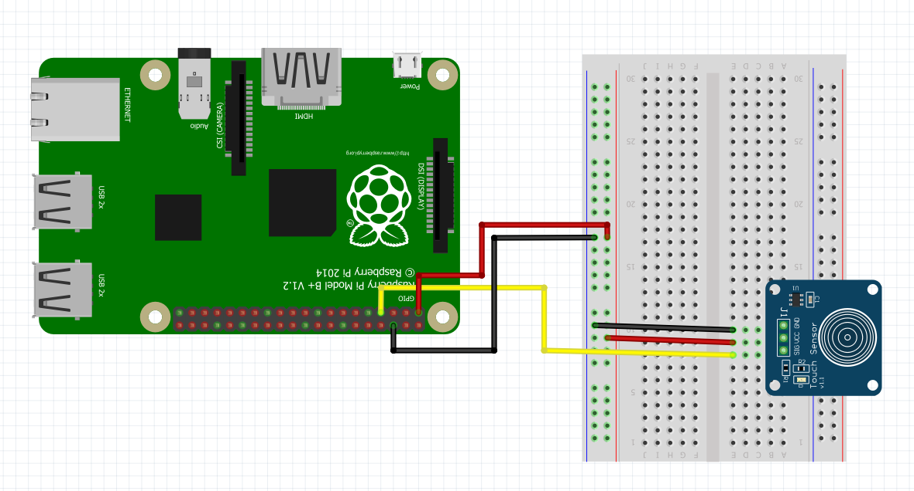

Capacitive Touch Sensor Module
------------------------------

In this example we are using a [momentary capacitive touch sensor](https://www.adafruit.com/product/1374).  The sensor kits mentioned in this book will also contain this sensor.  To set up the touch sensor connect the wires to the Raspberry Pi as shown in @fig:touch_setup.

{#fig:touch_setup}

Once you have set up the sensor you can use the touch_sensor class to execute another function when the sensor is touched.


```python

import RPi.GPIO as GPIO
import time
import sys
import os

class TouchSensor(object):
	"""docstring for TouchSensor"""
	def __init__(self, function, *args, pin=7, pin_setup='BOARD', **kwargs):
		self.pin = pin
		if pin_setup == 'BCM':
			GPIO.setmode(GPIO.BCM)
		else:
			GPIO.setmode(GPIO.BOARD)
		GPIO.setwarnings(False)
		GPIO.setup(self.pin,GPIO.IN)
		GPIO.remove_event_detect(self.pin)
		GPIO.add_event_detect(self.pin, GPIO.RISING, callback=lambda x: self.callback(function, *args, **kwargs))
		
	def callback(self, function, *args, **kwargs):
		if GPIO.input(self.pin) == 1:
			function(*args, **kwargs)
		else:
			pass
		

# wait for touch sensor activation

if __name__ == '__main__':
	try:
		def touch_print(text):
			print(text)

		TouchSensor(touch_print, 'Hey!', pin=13)
		while True:
			time.sleep(1)		
	except KeyboardInterrupt:
		print('\n\n *** Stopping Program ***')
		try:
			sys.exit(0)
		except SystemExit:
			os._exit(0)
```

## References

1. [Touch Sensor Class](https://github.com/cloudmesh-community/fa18-523-84/blob/master/paper/code/touch_sensor.py)
2. [Raspberry PI GPIO](https://sourceforge.net/p/raspberry-gpio-python/wiki/Inputs/)
3. [GPIO Events](https://stackoverflow.com/questions/16143842/raspberry-pi-gpio-events-in-python)
